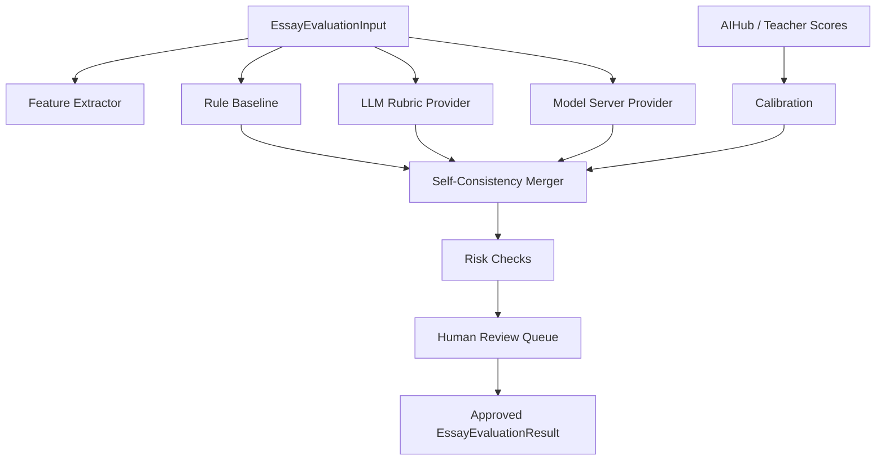

# Engine Architecture

## 모듈 구조

## 평가 단계

1. 입력 표준화
2. 루브릭 선택
3. 한국어/영어 feature extraction
4. rule baseline 점수 산출
5. 선택적으로 LLM rubric scorer 호출
6. 선택적으로 model server scorer 호출
7. self-consistency 합성
8. 장문 의존, 문항 재진술, 항목 간 점수 충돌, 낮은 confidence risk check
9. 사람 검수 대기 또는 자동 승인
10. 논술 마스터 API DTO로 변환

## 모델별 어댑터

- `ruleBaseline`: 즉시 적용 가능, 비용 없음, 정확도는 낮지만 안정적
- `llmRubricProvider`: OpenAI/호환 LLM, 가장 설명력이 좋음
- `modelServerProvider`: FastAPI/vLLM/KoBERT/LoRA 모델 서버
- `selfConsistency`: 여러 결과의 중앙값과 분산 기반 신뢰도 산출
- `datasets/aihub`: AIHub 데이터 매핑, raw data는 저장하지 않음
- `modelRegistry`: 모델별 용도, 언어, 루브릭, 적용 상태를 선언적으로 관리
- `calibration`: 사람 채점/AIHub 점수로 모델 점수 보정

## 논술 마스터 연결

`src/integrations/essayMaster.ts`의 `evaluateForEssayMaster`를 서버의 기존 `gradeEssayWithAi` 또는 `aiFeedback.ts` 앞단에 붙인다.

초기 운영 추천:

- 학생 실시간 피드백: rule baseline + LLM rubric
- 관리자 통계/모델 개선: rule baseline + LLM rubric + calibration
- 대량 채점: rule baseline + model server + sample LLM audit

## 검수 상태

운영 DB에는 다음 상태를 권장한다.

- `draft`: AI가 생성한 최초 평가 결과
- `needs_review`: 낮은 confidence, 점수 충돌, 장문/패턴 의존 위험 감지
- `approved`: 사람이 확인했거나 자동 승인 기준을 통과
- `rejected`: 루브릭 불일치, 복수 해석, 표절/패턴 답안 등으로 폐기
- `calibration_used`: 사람 검수 점수로 모델 보정에 사용 완료
